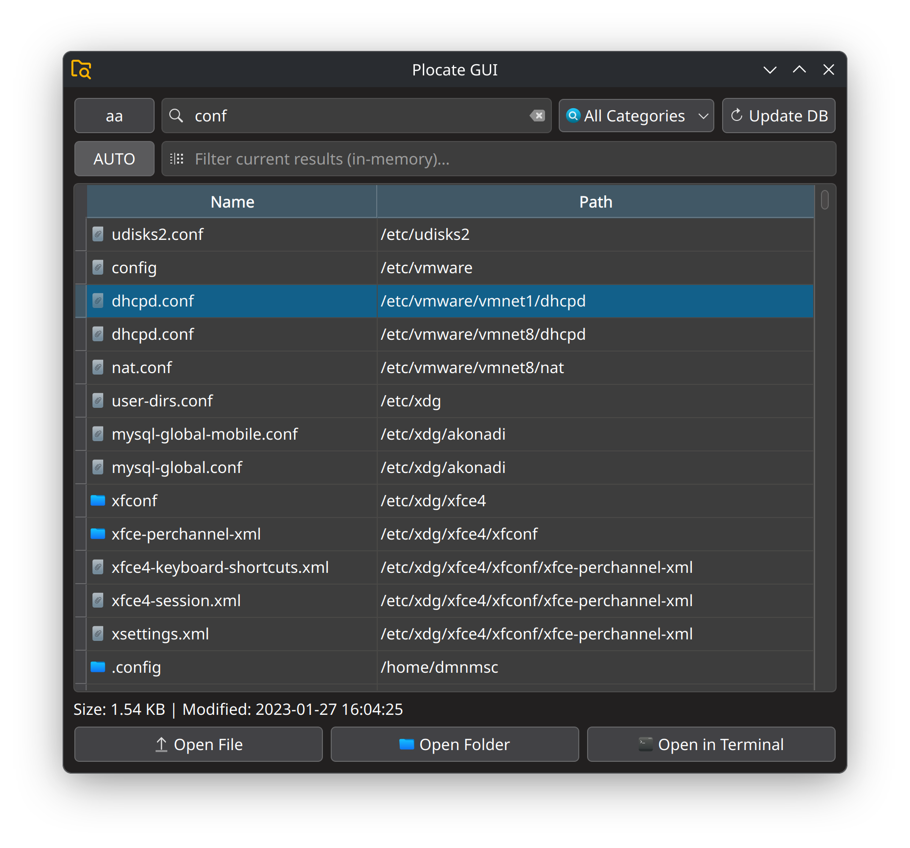

# Plocate GUI

A simple GUI for the `plocate` command-line utility on Linux systems. Built with PyQt6.

  

## Features

* **Fast Search:** Uses the `plocate` database.

* **Dual Database Support:** Searches system and optional external media databases concurrently.

* **Search Options:** Supports case-insensitive search (`-i`), regular expressions, and category filtering.

* **Database Update:** Executes `updatedb` via `pkexec` for system and external media indexes.

* **Item Selection (Reveal):** Highlights/selects the file in the native file manager when opening the containing folder (supports Dolphin and Nautilus).

* **Adaptive Design:** Automatic adjustment of table column widths when resizing the window.

* **Keyboard Shortcuts:**
    * **Enter** / Double-click: Opens the selected file.
    * **Ctrl+Enter** / Double-click (Path Column): Opens the containing folder.
    * **Ctrl+Shift+T**: Opens the containing folder in the **Terminal**.
    * **Ctrl+F**: Moves focus to the Search input field.
    * **Ctrl+G**: Moves focus to the Filter input field.
    * **Ctrl+Tab**: Cycles focus between the Search and Filter input fields.
    * **Ctrl+Shift+C**: Toggles Case Sensitivity.
    * **Ctrl+Shift+L**: Toggles Live Filtering (auto-filter).
    * **Ctrl+Shift+F**: Opens the Category Filter dropdown menu.
    * **F5**: Executes the database update process (`updatedb`).
    * **F1**: Opens the application's documentation/help.
    * **Esc**: Cancels current search/update task, clears results, or closes the application.

---
## Requirements

* Python 3.x
* The `plocate` package.
* PyQt6 libraries.

---
## Database Usage

The application is configured to work with the following default databases:

* **System:** `/var/lib/plocate/plocate.db` (updated with `pkexec updatedb`).

* **External Media:** `/var/lib/plocate/media.db` (created/updated with `pkexec updatedb -o ... -U /run/media`).

**Important Note:** Database updates (`Update Database`) require `pkexec` (provided by the **polkit** package) to be installed and configured to request root permissions, as the `updatedb` command needs privileges.
